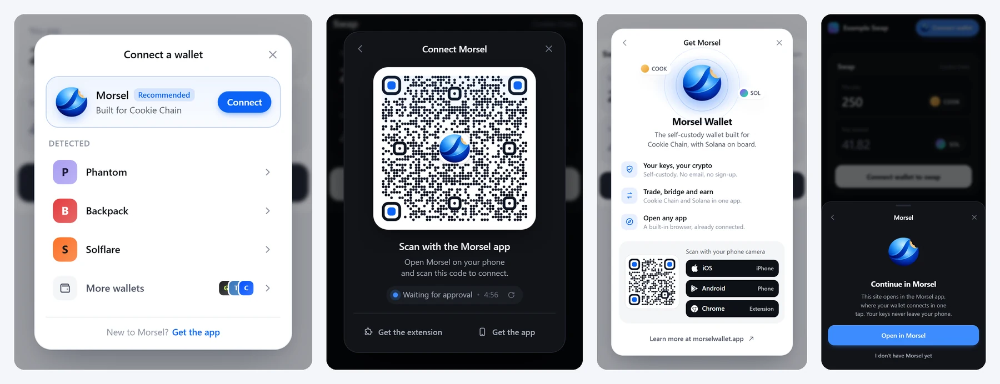

# @morsel-wallet/adapter

Connect Cookie Chain and Solana dApps to Morsel Wallet. The package has three layers:

- **Core** (`@morsel-wallet/adapter/core`, framework-agnostic): the Morsel adapter (injected
  extension, Morsel's in-app browser, and the encrypted QR relay to the Morsel phone app), a Wallet
  Standard adapter for every other wallet, and typed errors.
- **React hooks**: `WalletProvider`, `useWallet` and friends.
- **The Morsel connect widget**: a small, animated connect UI with Morsel as the hero, plus a styled
  connect button that turns into an account chip.



## Install

```bash
npm install @morsel-wallet/adapter @solana/web3.js
```

React 18 or 19 (with `react-dom`) is needed only for the hooks and the widget.

## Quick start

```tsx
import { WalletProvider, WalletModalProvider, WalletModal, ConnectButton } from '@morsel-wallet/adapter';

export default function App() {
  return (
    <WalletProvider>
      <WalletModalProvider>
        <header>
          <ConnectButton />
        </header>
        {/* your app */}
        <WalletModal />
      </WalletModalProvider>
    </WalletProvider>
  );
}
```

`WalletProvider` creates the Morsel adapter and discovers every installed Wallet Standard wallet
(Phantom, Backpack, Solflare, ...) by itself. Pass `adapters={[...]}` to control the list.

## The connect widget

`<WalletModal />` renders the widget (it is the default `variant="compact"`). It is a 360 px card on
desktop and a bottom sheet you can drag down to dismiss on phones. What it shows depends on where
the user is:

| Where | What happens when they pick Morsel |
|---|---|
| Desktop, Morsel extension installed | Connects through the extension: "Approve in Morsel". |
| Desktop, no extension | A branded QR to scan with the Morsel app, with a live "Waiting for approval" status, a 5-minute expiry and refresh. As soon as the phone scans it the widget switches to "Approve on your phone". Links to get the extension or the app. |
| Phone browser | "Continue in Morsel": opens the page inside Morsel's browser through a universal link, where it connects in one tap. |
| Inside Morsel's browser | No list at all: it connects straight away. |

Other installed wallets are listed under Morsel ("Detected"); wallets that are not installed sit
behind "More wallets". Declined requests, errors and expired QR codes each get their own screen with
a retry. "New to Morsel? Get the app" opens a short Get Morsel card (value props, platform links and,
on desktop, a download QR).

### WalletModal props

All props are optional.

| Prop | Type | Default | |
|---|---|---|---|
| `variant` | `'compact' \| 'premium' \| 'headless'` | `'compact'` | `premium` is kept for compatibility and renders the widget. `headless` is the bare, unstyled list. |
| `theme` | `'light' \| 'dark' \| 'system' \| 'auto'` | `'system'` | `system` follows the OS setting live. |
| `accentColor` | CSS colour | Morsel blue | Same as setting `--mw-accent`. |
| `placement` | `'center' \| 'anchor'` | `'center'` | `anchor` drops the widget down from the button that opened it (desktop). |
| `title` | `string` | `'Connect a wallet'` | Title of the wallet list. |
| `subtitle` | `string` | | Line under the title. |
| `logo` | URL or node | | Your dApp's logo, next to the title. |
| `networks`, `selectedNetworkId`, `onNetworkChange` | | | When `networks` has more than one entry, a small network switch is shown on the list. |
| `connectLabel` | `string` | `'Connect'` | Label of the Morsel action. |
| `installLabel` | `string` | `'Get'` | Label for wallets that are not installed. |
| `closeLabel` | `string` | `'Close'` | Accessible name of the close button. |
| `mobileDeepLink` | `string` | universal browse link | Override the "Open in Morsel" link on phones. |
| `links` | `{ install, ios, android, extension, website }` | Morsel's install page | Where the "Get Morsel" surfaces point. |
| `autoClose` | `boolean` | `true` | Close a moment after a successful connection. |
| `autoConnectInMorsel` | `boolean` | `true` | Inside Morsel's browser, connect without showing the list. |
| `showPoweredBy` | `boolean` | `false` | |
| `onConnectError` | `(error) => void` | | |
| `className`, `overlayClassName` | `string` | | Extra classes on the card and backdrop. |
| `zIndex` | `number` | `2147483000` | |
| `nonce` | `string` | | CSP nonce for the injected stylesheet. |

### ConnectButton

Without `className` or `children`, `ConnectButton` is the styled Morsel button: an accent pill that
opens the widget, then a compact account chip (avatar, wallet badge, short address and, when you pass
a `connection`, the native balance) with a menu to copy the address, switch wallet or disconnect.

```tsx
<ConnectButton connection={connection} balanceSymbol="COOK" theme="dark" />
```

| Prop | Default | |
|---|---|---|
| `theme`, `accentColor` | `'system'` | As on the widget. |
| `connection` | | A web3.js `Connection`; shows the balance in the chip. |
| `balanceSymbol` | `'COOK'` | |
| `disconnectedLabel` | `'Connect wallet'` | |
| `connectingLabel` | `'Connecting…'` | |
| `showLogo` | `true` | The Morsel mark on the button. |
| `size` | `'md'` | `'sm'` for tight headers. |
| `useModal` | | `false` connects the active adapter directly instead of opening the widget. |

With `className` or `children` it keeps its original behaviour: an unstyled `<button>` you style
yourself, which disconnects when clicked while connected (`showAddress`, `connectedLabel` apply).

### Opening it from code

```tsx
const { open, close, visible } = useWalletModal();

open();                                  // wallet list
open({ view: 'get-morsel' });            // the Get Morsel card
open({ anchor: buttonRef.current });     // with placement="anchor"
```

### Theming and isolation

Every class is prefixed `mw-` and scoped under `.mw-scope`, so nothing leaks into your page and your
global `button` / `img` rules do not leak in. The stylesheet is injected once into `<head>` (pass
`nonce` for strict CSP, or ship `getMorselConnectCss()` yourself). Override any token from your CSS:

```css
.mw-scope {
  --mw-accent: #ff6b00;
  --mw-radius: 20px;
  --mw-font: 'Inter', system-ui, sans-serif;
}
.mw-scope[data-mw-theme='dark'] {
  --mw-bg: #0b0b0f;
}
```

Tokens: `--mw-accent`, `--mw-accent-fg`, `--mw-bg`, `--mw-bg-2`, `--mw-bg-3`, `--mw-fg`, `--mw-fg-2`,
`--mw-fg-3`, `--mw-line`, `--mw-overlay`, `--mw-success`, `--mw-danger`, `--mw-warn`, `--mw-shadow`,
`--mw-radius`, `--mw-font`, `--mw-z`.

### Motion and accessibility

- Animations use only `transform` and `opacity`, through the Web Animations API and CSS; there is no
  animation library. The card height morphs between screens, the Morsel mark flies between them,
  lists stagger in and springs are real spring curves (`linear()` easing).
- `prefers-reduced-motion` turns every movement into a short fade.
- The widget is a labelled modal dialog with a focus trap, Esc to close, arrow keys through the
  wallet list, focus returned to the button on close, and live regions for status changes.
- SSR: nothing touches `window` during render; the widget mounts on the client through a portal.

## Morsel adapter (core)

```ts
import { MorselCookieWalletAdapter } from '@morsel-wallet/adapter/core';

const morsel = new MorselCookieWalletAdapter();
morsel.wcUri;                 // morsel://connect?... pairing URI for your own QR
morsel.relayStatus;           // 'waiting' | 'scanned' | 'rejected' | 'connected' | 'idle'
morsel.on('relayStatusChange', (status) => {});
morsel.on('wcUriChange', (uri) => {});
morsel.restartRelaySession(); // fresh QR (the relay keeps a pairing for 5 minutes)
```

The relay is end-to-end encrypted (NaCl box) between the page and the Morsel app; the relay server
only forwards ciphertext.

## Hooks

```tsx
import {
  useWallet,
  useWalletConnection,
  useWalletAddress,
  useSignMessage,
  useSignTransaction,
  useSendTransaction,
  useWalletBalance,
  useWalletStatus,
  useOnConnect,
  useOnDisconnect,
} from '@morsel-wallet/adapter';

const { connected, publicKey, connecting, adapters, connect, disconnect } = useWallet();
const address = useWalletAddress(); // base58 string or null
const signMessage = useSignMessage();
const { signature } = await signMessage(new TextEncoder().encode('hello'));
```

## Upgrading from 0.1.x

- `WalletModal` now renders the compact widget by default; `variant="premium"` renders it too.
  `variant="headless"` is unchanged.
- `ConnectButton` without `className` / `children` is now styled and opens the widget. Pass a
  `className` to keep the old unstyled button.
- `useWalletModal().open()` takes an optional `{ view, anchor }`; calling it with nothing (or as an
  event handler) works as before.
- `react-dom` is now an (optional) peer; `qrcode` is no longer a dependency, and the kit no longer
  imports PNG files, so no bundler configuration is needed.
- The core no longer needs a global `Buffer` polyfill.

## Development

```bash
npm install
npm test             # build, then unit tests (node:test)
npm run playground   # http://localhost:5178, a demo dApp with the relay and wallets stubbed
npm run size         # what a dApp ships, minified and gzipped
```

In the playground, `window.__mw` drives every stage: `__mw.relay.scan() / approve() / reject()`,
`__mw.expireQr()`, `__mw.walletMode.mode = 'reject' | 'error' | 'hang'`, and the URL takes
`theme`, `platform=ios|android|inapp`, `ext=1` (Morsel extension present) and `place=anchor`.

## License

MIT
